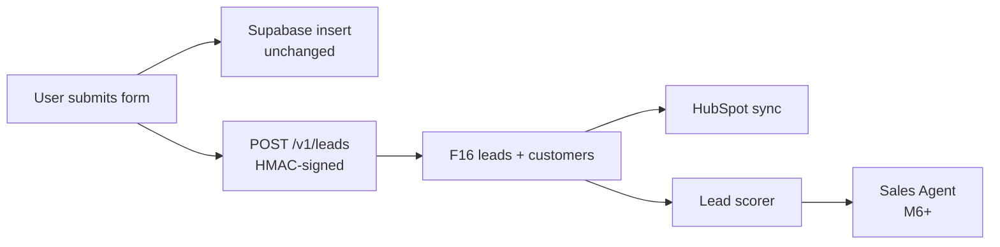

# Runbook — Website to F16 Lead Webhook Integration

**Audience:** Achraf (website / Lovable owner), with a side-pocket of follow-ups for Ridaa (F16 backend)
**Task ID:** M5.T5
**Date:** 2026-05-17
**Status:** Ready to execute on Achraf's side. Two follow-ups for Ridaa (CORS, prod domain) are flagged inline.

This runbook walks Achraf through wiring the `assuryalconseil.fr` website forms to F16's lead intake webhook. After this change, every form submission lands in both Supabase (unchanged) and F16 (new). F16 then becomes the canonical lead store and drives the rest of the funnel (HubSpot mirror, Lead Scorer, Sales Agent).

No F16 backend code changes are required for this task — the endpoint already exists. What does change is one form-submit handler in the Lovable project and two env vars in Lovable settings.

---

## 1. Goal & Current vs Target State

### 1.1 Current state

```
[assuryalconseil.fr form]
        |
        v
  Supabase.leads.insert()
        |
        v
   (Achraf opens HubSpot manually, copies the lead in)
```

A submission today writes one row to Achraf's Supabase. Everything downstream (HubSpot entry, call-back) is manual.

### 1.2 Target state (after this runbook)

```
[assuryalconseil.fr form]
        |
        +--> Supabase.leads.insert()                  (unchanged — best-effort fallback)
        |
        \--> POST F16 /v1/leads  (HMAC-signed, fire-and-forget)
                    |
                    v
              F16 leads table  ──>  LEAD.NEW fan-out
                                     |
                                     +--> hubspot-sync (M5.T2) creates Contact + Deal
                                     +--> lead-scorer  (M5.T3) scores + spawns Sales Agent (M6+)
```

Mermaid version (for the PR description if Achraf wants one):



**Key invariant:** the Supabase write stays exactly as it is. F16 is _additive_. If F16 is unreachable, the website's behaviour is identical to today — the user still gets their confirmation, the lead is still logged in Supabase. F16 will simply miss that submission. By design.

---

## 2. What Achraf changes in the website code

The Lovable project lives at `Assuryal/conversion-machine-main/` and is a Vite + React + Supabase + react-hook-form app.

### 2.1 Find the form handler

The submission handler is almost certainly inside `src/components/QuoteForm.tsx` (the shared quote form used by `AutoPage.tsx`, `MotoPage.tsx`, `TrottinettePage.tsx`, etc.). If Achraf has product-specific forms, they may live alongside their page files in `src/pages/`.

Look for:

- a `useForm(...)` call (react-hook-form),
- an `onSubmit` handler passed to `<form onSubmit={handleSubmit(onSubmit)}>`,
- a call to `supabase.from('leads').insert(...)` (or similar) inside that handler.

The new code goes **right after** the Supabase insert. Do not replace the Supabase write — keep both.

### 2.2 Add the parallel F16 call

Inside the `onSubmit` handler, after the existing Supabase write:

```ts
const f16Payload = {
  source: 'website' as const,
  sourceId: crypto.randomUUID(), // can also use the Supabase row id when available
  productLine: data.productType === 'scooter' ? 'scooter' : 'car',
  fullName: [data.firstName, data.lastName].filter(Boolean).join(' ') || undefined,
  email: data.email || undefined,
  phone: data.phone || undefined,
  formAnswers: { ...data }, // full form snapshot for audit
  raw: {
    submittedAt: new Date().toISOString(),
    userAgent: navigator.userAgent,
  },
};

// Fire-and-forget. Do NOT await this from the user-facing critical path —
// a slow F16 must not slow the confirmation the user sees.
void (async () => {
  try {
    const body = JSON.stringify(f16Payload);
    const sig = await computeHmac(body, import.meta.env.VITE_F16_HMAC);
    await fetch(import.meta.env.VITE_F16_LEADS_URL, {
      method: 'POST',
      headers: {
        'content-type': 'application/json',
        'x-f16-signature': sig,
      },
      body,
    });
  } catch (err) {
    // F16 is best-effort — Supabase write is canonical for the website.
    console.warn('F16 webhook failed (non-fatal)', err);
  }
})();
```

Two important details:

1. **`source` must be the literal string `'website'`.** F16's zod schema rejects anything else for the website channel.
2. **`productLine` must be exactly `'scooter'` or `'car'`.** Map whatever the form's product field is into one of those two values. Anything else => 400 from F16.

### 2.3 The HMAC helper

Add this helper to the same file (or a small `src/lib/f16.ts` if Achraf prefers reuse across forms). F16 verifies signatures with SHA-256, hex-encoded, optionally prefixed with `sha256=`. The backend code uses the secret bytes raw — so the helper must do the same.

```ts
async function computeHmac(body: string, secret: string): Promise<string> {
  const enc = new TextEncoder();
  const key = await crypto.subtle.importKey(
    'raw',
    enc.encode(secret),
    { name: 'HMAC', hash: 'SHA-256' },
    false,
    ['sign'],
  );
  const sig = await crypto.subtle.sign('HMAC', key, enc.encode(body));
  return (
    'sha256=' +
    Array.from(new Uint8Array(sig))
      .map((b) => b.toString(16).padStart(2, '0'))
      .join('')
  );
}
```

The `sha256=` prefix is GitHub-style and matches what F16's `verifyHmac()` accepts.

### 2.4 Why fire-and-forget

The user-facing form flow today is `submit -> Supabase insert -> show success`. We must not push F16 into that critical path:

- F16 may live on a different region / domain — a network hop costs 50–300 ms.
- F16 may be temporarily unhealthy — we accept that and prefer Supabase fallback.
- The HMAC `crypto.subtle.sign` call itself is fast (sub-ms), but the network call to F16 is what we don't want to block on.

So wrap the F16 call in `void (async () => { ... })()` (as shown above) — the outer `onSubmit` never `await`s it. The user still sees their confirmation as fast as today.

---

## 3. Env vars to add in Lovable

In Lovable: **Settings → Environment Variables**, add:

| Variable             | Value (V1)                                                     | Notes                                                                          |
| -------------------- | -------------------------------------------------------------- | ------------------------------------------------------------------------------ |
| `VITE_F16_LEADS_URL` | `http://localhost:3001/v1/leads` (dev) / TBD prod (see §6)     | Public F16 endpoint. Vite requires the `VITE_` prefix to expose at build time. |
| `VITE_F16_HMAC`      | Copy of F16's `HMAC_WEBHOOK_SECRET` (from M1.T8 secret bundle) | Used by `computeHmac()` above.                                                 |

### 3.1 HMAC-in-browser trade-off — read this

`VITE_*` variables are baked into the production JS bundle at build time. Anyone who opens devtools can read `VITE_F16_HMAC`. This is a known trade-off, and we accept it for V1 because:

- The leads endpoint is rate-limited (30 req/min/IP).
- Lead spam is annoying but not catastrophic — at worst, a few bogus rows in `leads` that the Lead Scorer downgrades to score 0.
- The HMAC is still useful: it blocks accidental third-party traffic and gives us a fast 401 path for malformed origins.

**V2 fix (out of scope for this runbook):** move the F16 call to a Supabase Edge Function or a Cloudflare Worker so the secret never reaches the browser. The website calls the worker (no secret), the worker signs and forwards. Cleaner, but adds a moving part.

---

## 4. CORS — Ridaa's follow-up, flagged here

F16's Hono app at `backend/src/index.ts` currently has **no CORS middleware**. The first browser POST from `assuryalconseil.fr` (or `localhost:5173`) will be blocked by the browser's CORS preflight before it ever hits F16.

**This is not part of M5.T5.** It's a small Ridaa-side follow-up. The fix:

```ts
// backend/src/index.ts — to be added by Ridaa
import { cors } from 'hono/cors';

const allowed = (process.env.F16_ALLOWED_ORIGINS ?? '')
  .split(',')
  .map((s) => s.trim())
  .filter(Boolean);

app.use(
  '/v1/leads',
  cors({
    origin: (origin) => (allowed.includes(origin) ? origin : null),
    allowMethods: ['POST', 'OPTIONS'],
    allowHeaders: ['content-type', 'x-f16-signature'],
    maxAge: 600,
  }),
);
```

New env var on F16 backend:

```
F16_ALLOWED_ORIGINS=https://assuryalconseil.fr,http://localhost:5173
```

**TODO (Ridaa):** ship the CORS middleware as a tiny follow-up PR before Achraf points production traffic at F16. Locally, Achraf can still test against `localhost:3001` because both ends are same-origin-ish via `localhost`, but the browser will still preflight — verify in the Network tab.

---

## 5. Testing checklist (Achraf, before pushing the Lovable PR)

Run F16 locally first. From a terminal in `Assuryal/F16/backend`:

```bash
pnpm dev   # boots Hono on :3001 with the leads route mounted
```

Make sure the F16 `.env` has `HMAC_WEBHOOK_SECRET` set, and that the exact same secret is in Lovable's `VITE_F16_HMAC`.

Then, in the Lovable preview:

1. Set `VITE_F16_LEADS_URL=http://localhost:3001/v1/leads` and `VITE_F16_HMAC=<the secret>`.
2. Reload the preview (Vite has to re-bundle to pick up `VITE_*` vars).
3. Submit the quote form with realistic values (one scooter, one car).
4. Open DevTools → Network. You should see:
   - The Supabase request (unchanged from today, 2xx).
   - A `POST /v1/leads` to `localhost:3001` returning `200 OK` with body `{ accepted: true, leadId, customerId, dedup }`.
5. In the F16 terminal, you should see a Pino JSON log line `lead ingested` with the same `leadId`.
6. (Optional) Query the F16 DB to confirm rows:

   ```sql
   SELECT id, source, product_line, status, created_at FROM leads ORDER BY created_at DESC LIMIT 5;
   SELECT id, full_name FROM customers ORDER BY created_at DESC LIMIT 5;
   ```

7. Re-submit the same phone number once more. The second response should be `200` with `dedup: 'matched_existing'` and the same `customerId`. A _new_ `leads` row is still created — that's intentional (every submission is a signal).

---

## 6. What Ridaa changes on F16 side (not blocking Achraf)

These three items are on Ridaa's plate and run in parallel with Achraf's work.

1. **Pick a public domain for the F16 leads endpoint.** Suggested: `api.f16.assuryalconseil.fr` or `webhooks.assuryalconseil.fr`. Either works. The decision happens at deploy time in M17 — until then, Achraf's prod env stays pointed at a staging URL or a Cloudflare tunnel.
2. **Add CORS middleware** (see §4). Trivial Hono PR.
3. **Rotate `HMAC_WEBHOOK_SECRET` after the first production deploy.** The current value was generated by M1.T8 and has been visible to the implementer; treat it as dev-only. After rotation, push the new secret to Lovable's `VITE_F16_HMAC` and bounce both ends.

---

## 7. Failure modes & what they look like

| Symptom                                             | What it means                                                                                                                                                 | Fix                                                                                                                                                  |
| --------------------------------------------------- | ------------------------------------------------------------------------------------------------------------------------------------------------------------- | ---------------------------------------------------------------------------------------------------------------------------------------------------- |
| F16 returns `401 invalid_signature`                 | HMAC mismatch — the secret in Lovable doesn't match `HMAC_WEBHOOK_SECRET` on F16, or the body was mutated between sign and send.                              | Re-copy the secret end-to-end. Confirm `computeHmac()` signs the _exact_ JSON string sent in the body (don't re-stringify).                          |
| F16 returns `400 invalid_payload`                   | Zod rejected the body. Most common: `source` not `'website'`, or `productLine` not `'scooter' \| 'car'`, or `email` not a valid email.                        | Check F16 logs — `'lead intake: invalid payload'` carries the parse error message (no PII). Fix the field mapping.                                   |
| F16 returns `429 rate_limited`                      | Same IP exceeded 30 req/min. Only realistic during stress tests.                                                                                              | Wait a minute; verify production traffic doesn't actually hit this (it won't at expected ~50 leads/day).                                             |
| F16 unreachable (`net::ERR_*`, CORS error, timeout) | Either F16 is down, CORS isn't wired (§4), or DNS isn't pointed at the right host.                                                                            | Website still works, Supabase still writes — F16 misses this lead. **This is by design.** Investigate F16 backend separately; do not block the form. |
| Same lead submitted twice                           | F16 returns `200` both times. First: `dedup: 'new_customer'`. Second: `dedup: 'matched_existing'`, same `customerId`. A new `leads` row is created each time. | No action — this is expected. The Lead Scorer collapses signals downstream.                                                                          |

---

## 8. What to expect after a lead lands in F16

Timeline once `/v1/leads` returns `200`:

- **~1 s:** `leads` row created, `LEAD.NEW` emitted on the dispatcher.
- **~5 s:** HubSpot Sync agent (M5.T2) creates the Contact + Deal. `leads.hubspot_deal_id` populated.
- **~30 s (live LLM):** Lead Scorer (M5.T3) assigns a score (0–100), updates `leads.status = 'scored'`, spawns a Sales Agent shell.
- **Once M6 lands:** the Sales Agent sends the first WhatsApp message (template-based, then conversational).

If any of those steps fails, F16 logs the failure but the lead row stays in `status='new'` — easy to spot in admin and replay.

---

## 9. Rollback plan

If the F16 webhook starts causing user-visible form issues (e.g. errors surfacing in the UI, slow submits):

1. **First, verify it really is fire-and-forget.** Open `QuoteForm.tsx` (or wherever the handler lives) and confirm the F16 block is wrapped in `void (async () => { ... })()` with no `await` on the outer `onSubmit`. If an `await` slipped in, that's the bug — drop it.
2. **If that's not it, remove the F16 block entirely.** The Supabase write is unchanged; customers still get logged. F16 will just stop receiving website leads until we ship a fix.
3. Notify Ridaa — the F16 backend logs (`lead intake: …`) will tell us why F16 was misbehaving.

There is no DB rollback to perform on F16 — `leads` rows are append-only audit data and harmless to keep.

---

## 10. Open question for Achraf

How will the change land in the Lovable codebase?

- **Recommended:** Achraf uses Lovable's chat UI to make the edit (his normal workflow). Paste the snippets from §2 and §3 verbatim and let Lovable wire them into `QuoteForm.tsx`. Lovable handles the PR / commit on its side.
- **Alternative:** Ridaa opens a PR against the `conversion-machine-main` repo directly. This works but breaks the muscle memory of "all website changes go through Lovable" — only do this if Lovable's chat fights the diff.

Either way, the env vars (`VITE_F16_LEADS_URL`, `VITE_F16_HMAC`) must be added through **Lovable → Settings → Environment Variables** so the Vite build picks them up. Lovable's chat UI cannot set those for you.

---

## Appendix — Reference: F16 endpoint contract

For the avoidance of doubt, the contract Achraf is integrating against:

- **URL:** `POST /v1/leads`
- **Headers:**
  - `content-type: application/json`
  - `x-f16-signature: sha256=<hex>` — HMAC-SHA256 of the exact request body, secret = `HMAC_WEBHOOK_SECRET`
- **Body (zod-validated):**
  ```json
  {
    "source": "website",
    "sourceId": "optional-string",
    "productLine": "scooter | car",
    "fullName": "optional",
    "email": "optional, must be a valid email if present",
    "phone": "optional, E.164 preferred; FR national numbers normalized server-side",
    "formAnswers": { "...": "free-form jsonb" },
    "raw": { "...": "free-form jsonb" }
  }
  ```
- **Responses:**
  - `200 { accepted: true, leadId, customerId, dedup: 'new_customer' | 'matched_existing' }`
  - `400 { error: 'invalid_payload' }`
  - `401 { error: 'invalid_signature' }`
  - `429 { error: 'rate_limited' }`
  - `500 { error: 'ingest_failed' }`

Source of truth: `backend/src/leads/intake-http.ts` and `backend/src/leads/intake.ts`.
